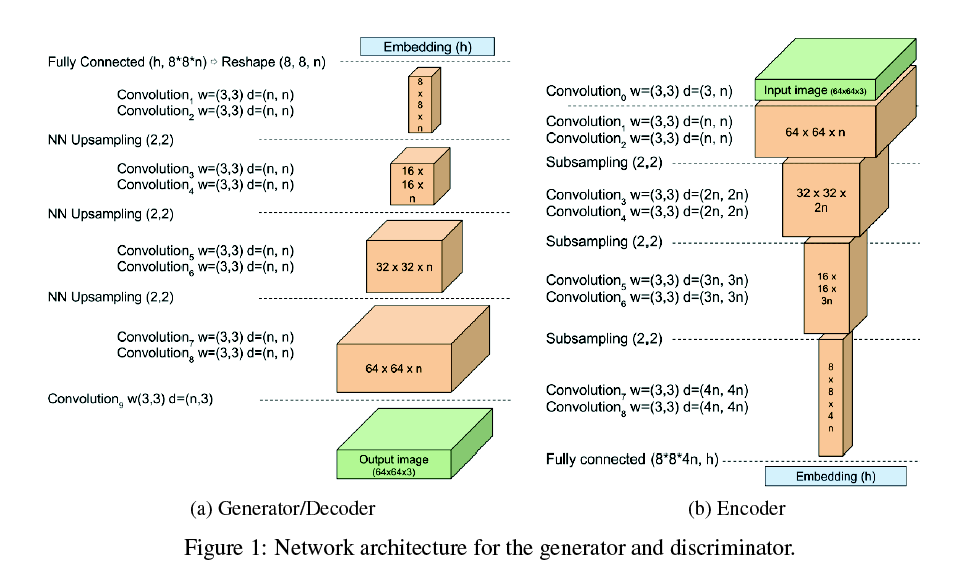
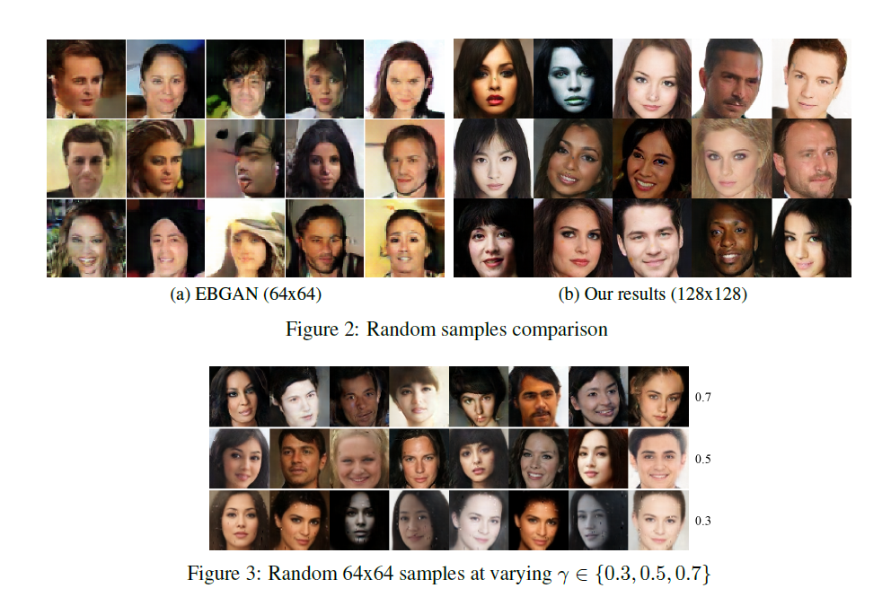
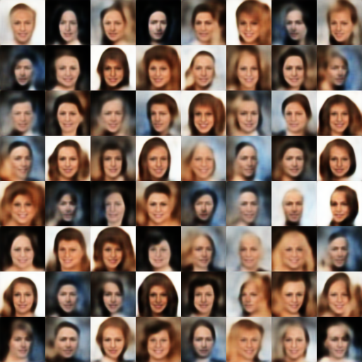
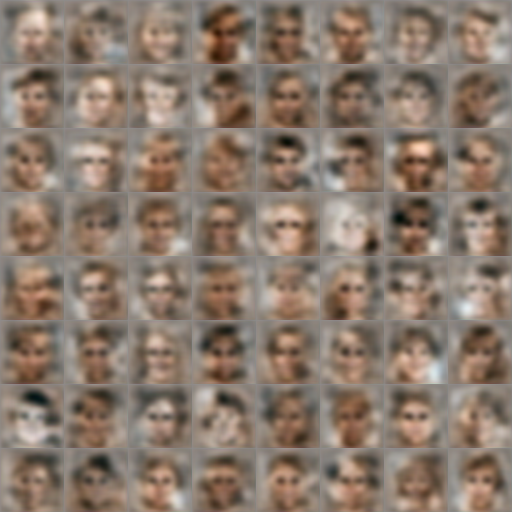
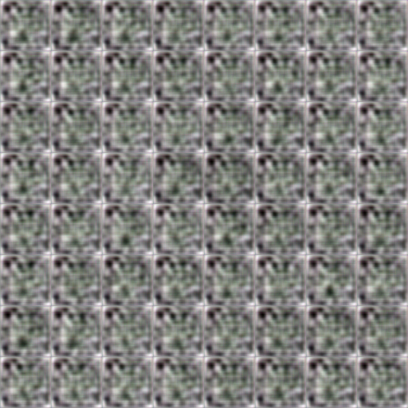
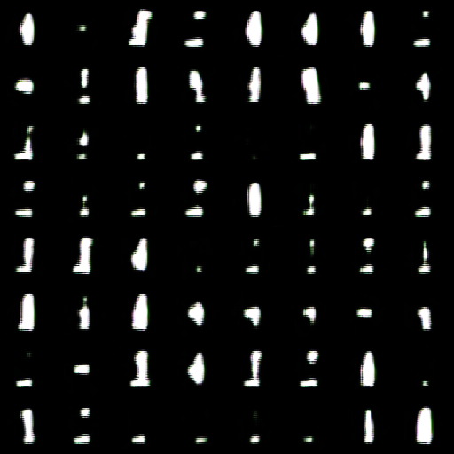
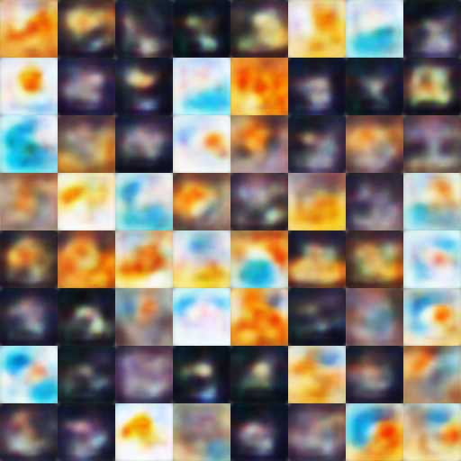
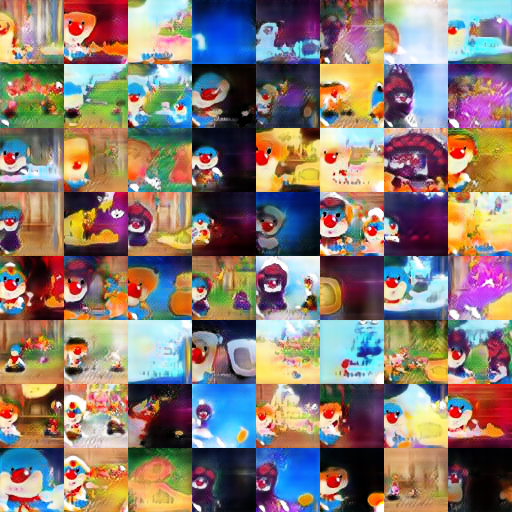
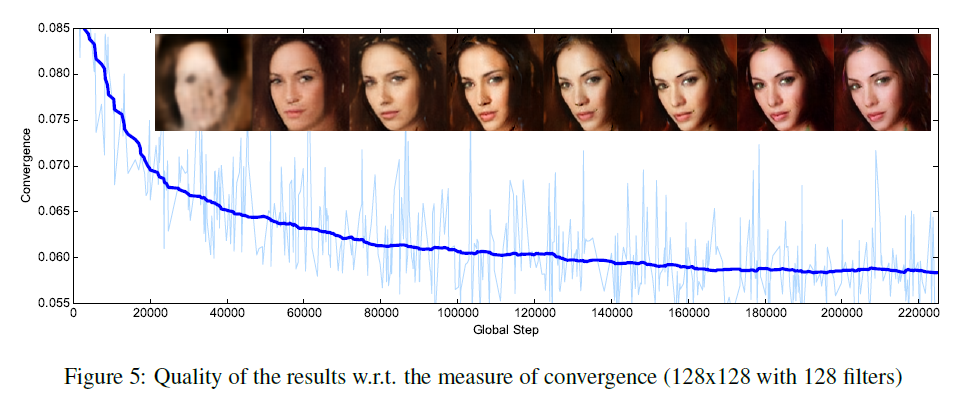

# BEGAN implementation in Tensorflow

Paper: [BEGAN: Boundary Equilibrium Generative Adversarial Networks](https://arxiv.org/abs/1703.10717).

## Requirements

- Python 2.7
- Pillow
- prettytensor
- scipy
- progressbar
- TensorFlow 0.2.0 (or higher)

## Usage

First download [CelebA](http://mmlab.ie.cuhk.edu.hk/projects/CelebA.html) datasets with:

    $ apt-get install p7zip-full # ubuntu
    $ brew install p7zip # Mac
    $ python download.py

or you can use your own dataset by placing images like:

    data
    └── YOUR_DATASET_NAME
        ├── xxx.jpg (name doesn't matter)
        ├── yyy.jpg
        └── ...

To train a model:

    $ python main.py --dataset=CelebA --use_gpu=True
    $ python main.py --dataset=YOUR_DATASET_NAME --use_gpu=True

To test a model (use your `load_path`):

    $ python main.py --dataset=CelebA --load_path=CelebA_0405_124806 --use_gpu=True --is_train=False --split valid

1. First, download the [CelebA](http://mmlab.ie.cuhk.edu.hk/projects/CelebA.html) dataset

2. Second, extract the dataset and cut the image into 64x64

3. Third, the dataset folder should be like:

	dataset_folder
	|
	------xx.jpg
	|
	------aa.jpg

4. Fourth, train the model:

   $ python main.py --working_directory='A_PATH_TO_PLACE_YOUR_MODEL' --data_directory='A_PATH_TO_YUR_DATASET'
   fe:
   $ python main.py --working_directory='./celebA_train' --data_directory='../data/dataset'
   
5. Fifth, to view the result:

   the image generated by the model will be saved every 100 batch training.
   and the image will be place at:A_PATH_TO_PLACE_YOUR_MODEL/imgs/

6. Sixth, the model will be train and saved every 100 batch. You can go on training:

   $ python main.py --working_directory='A_PATH_TO_PLACE_YOUR_MODEL'
   no data_directory needed this time.
   
   Agg.png are the images generated by the generator and the Agg_d.png are the images generated by autoencoder.

## Results

### [CelebA dataset] Autoencoded outputs (after only 6.2k step)

### [CelebA dataset] Generator outputs (after only 6.2k step)

### [Mnist dataset] Autoencoded outputs (after only 3.4k step)

### [Mnist dataset] Generator outputs (after only 3.4k step)

### [custom dataset] Autoencoded outputs (after only 1.2k step)

###

For lack of training the model is still far from convergence.
In my experiment, began can convergent faster in CelebA dataset.
But it perform poorly in some really wild dataset.

My custom dataset is a set of shotcut built from over 156 cartoon videos.
BEGAN can not show any convergence clues in mine custom dataset.
However dcgan with batch discriminator can convergent on that.

### [custom dataset] Generator outputs (after 148k step)

### Measure of Convergence

I will update the result soon.
## Author

Yuletian
