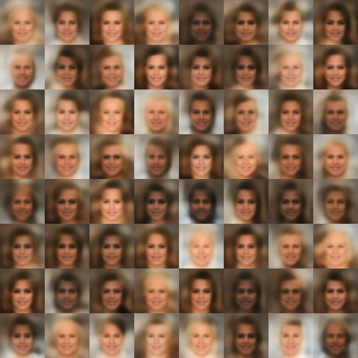

# BEGAN implementation in Tensorflow

Paper[BEGAN: Boundary Equilibrium Generative Adversarial Networks](https://arxiv.org/abs/1703.10717).

## Requirements

- Python 2.7
- Pillow
- prettytensor
- scipy
- progressbar
- TensorFlow 0.2.0 (or higher)

## Usage

1. First, download the [CelebA](http://mmlab.ie.cuhk.edu.hk/projects/CelebA.html) dataset

2. Second, extract the dataset and cut the image into 64x64

3. Third, the dataset folder should be like:
	dataset_folder
	|
	------xx.jpg
	|
	------aa.jpg
4. Four, train the model:
   $ python main.py --working_directory='A_PATH_TO_PLACE_YOUR_MODEL' --data_directory='A_PATH_TO_YUR_DATASET'
   fe:
   $ python main.py --working_directory='./celebA_train' --data_directory='../data/dataset'
   
5. Five, to view the result:
   the image generated by the model will be saved every 100 batch training.
   and the image will be place at:A_PATH_TO_PLACE_YOUR_MODEL/imgs/
   
   Agg.png are the images generated by the generator and the Agg_d.png are the images generated by autoencoder.

## Results

### Autoencoded Generator outputs (after only 3k step)

### Generator and Discriminator outputs (after only 3k step)

For lack of training the model is still far from convergence.
## Author

Yuletian
